# Home-Assistant-Config
Welcome to theglus's Home Assistant setup. I hope you find value in the projects and documentation I've been working on. I'll be continuting to update my documentaion in the coming weeks so stay tuned. 
## Table of Contents 
* [Hardware](#hardware)
* [Software](#software)
* [Devices](#devices)
* [Lovelace Dashboards](#lovelace-dashboards)
* [Automations](#automations)
* [Planned Improvements](#planned-improvements)
## Hardware
* [Home Assistant Server](#home-assistant-server)
* [Network](#network)
### Home Assistant Server
My Home Assistant setup is pretty basic but it gets the job done without any hiccups.
| [Raspberry Pi 4 Model B 4GB](https://www.amazon.com/Raspberry-Model-2019-Quad-Bluetooth/dp/B07TC2BK1X?th=1) | [Raspbee II](https://www.amazon.com/Phoscon-RaspBee-II/dp/B084MK8F5M) | [SanDisk Extreme 64GB MicroSD](https://www.amazon.com/SanDisk-Extreme-microSDXC-UHS-I-Adapter/dp/B01HU3Q6S4) | [Argon Neo Case](https://www.amazon.com/Argon-Raspberry-Heatsink-Supports-Accessible/dp/B07WMG27T7) |
| --- | --- | --- | --- |
|  |  |  |  |

I opted to go the Zigbee route primarily because I really like the Aqara platform. I landed on the Raspbee II over the Conbee as it just seemed like a more elegant solution. It's a little bit of a pain to initially setup, but after that it's smooth sailing. 
### Network
Living in a 950 sqft Loft apartment, I don't have to worry about signal strength. My setup consists of a Google WiFi puck in the Living Room. This is my primary router: one end connects to my in-wall ethernet port and the other end to a TP-Link 8-port network switch. 
| [Google Wifi](https://store.google.com/us/product/google_wifi_2nd_gen?hl=en-US) | [TP-Link Switch](https://www.amazon.com/gp/product/B00A121WN6/ref=ppx_od_dt_b_asin_title_s00?ie=UTF8&psc=1) | [MoCa Network Adapter](https://www.amazon.com/Actiontec-MoCA-Network-Adapter-Ethernet/dp/B013J7O3X0/ref=sr_1_3?dchild=1&keywords=ethernet%2Bover%2Bcoax&qid=1629947247&sr=8-3&th=1) |
| --- | --- | --- |
| 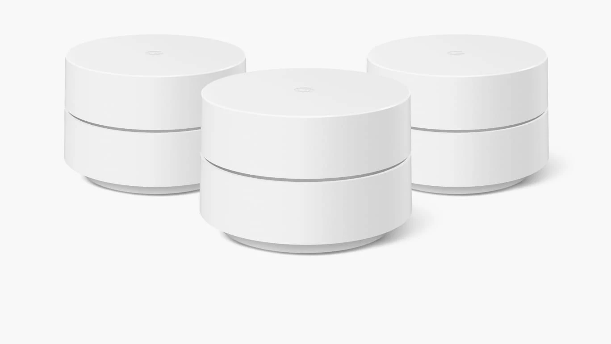 | 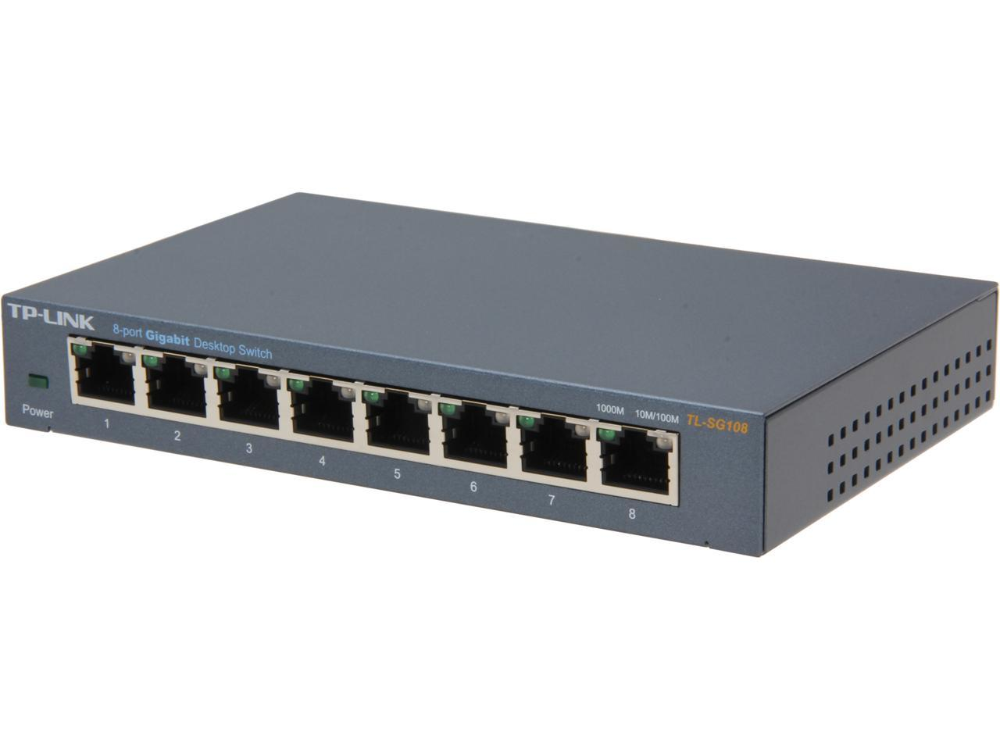 | 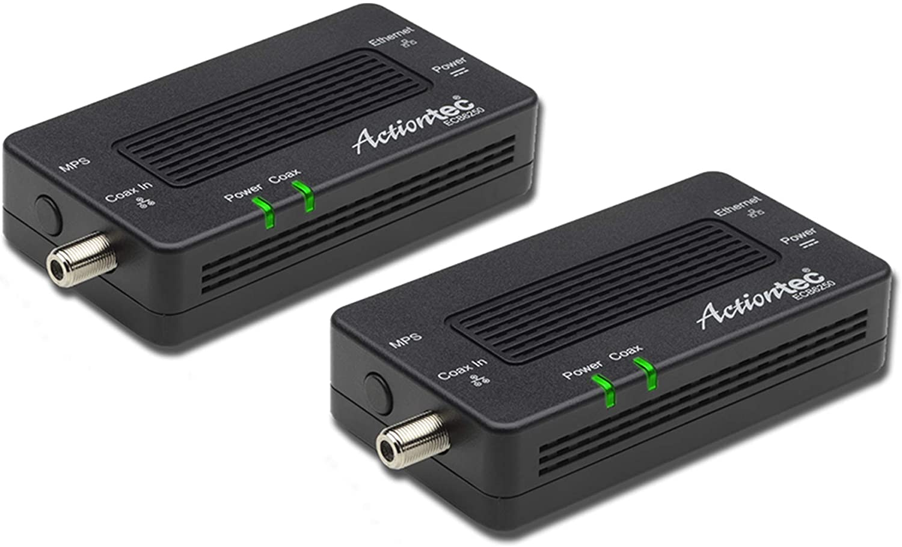 |

But you can't have a mesh network with just one puck, so in order to eliminate the potential for any deadzones, I've placed another puck upstairs in the Loft.

I routinely stream games via Moonlight from my desktop computer (in the Office) to the TV (in the Living Room). Initially, I did this over WiFi, but had very little success. Fortunately, there is a coax outlet right under my desk, so using ethernet-over-coax, I am able to hardwire to the network switch in the Living Room.

## Software
* [Architecture](#architecture)
* [Integrations](#integrations)
* [Custom Components](#custom-components) 
* [Voice Assistant](#voice-assistant) 
### Architecture
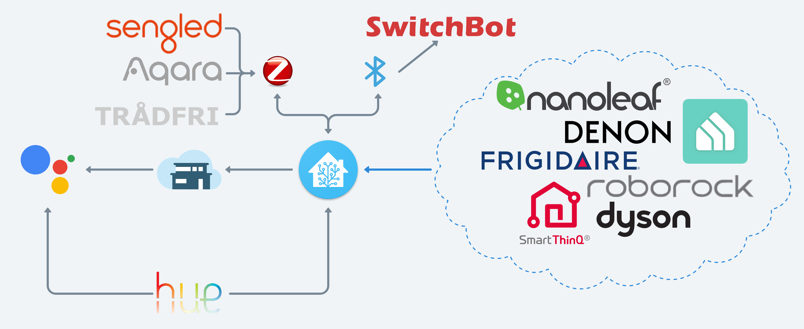 
### Integrations
- [Air Visual](https://www.home-assistant.io/integrations/airvisual)
- [ClimaCell](https://www.home-assistant.io/integrations/climacell)
- [deCONZ](https://www.home-assistant.io/integrations/deconz)
- [Denon AVR Network Receiver](https://www.home-assistant.io/integrations/denonavr)
- [Denon HEOS](https://www.home-assistant.io/integrations/heos)
- [DLNA](https://www.home-assistant.io/integrations/dlna_dmr)
- [Google Cast](https://www.home-assistant.io/integrations/cast)
- [Mobile App](https://www.home-assistant.io/integrations/mobile_app)
- [MQTT](https://www.home-assistant.io/integrations/mqtt)
- [Nanoleaf](https://www.home-assistant.io/integrations/nanoleaf)
- [Philips Hue](https://www.home-assistant.io/integrations/hue)
- [Sony Bravia TV](https://www.home-assistant.io/integrations/braviatv)
- [Tile](https://www.home-assistant.io/integrations/tile)
- [TP-Link Kasa Smart](https://www.home-assistant.io/integrations/tplink)
- [Xiaomi Miio](https://www.home-assistant.io/integrations/xiaomi_miio)

### Custom Components
- [HACS](https://github.com/hacs/integration): Allows for the installation and management of the various custom components.
- [BrowserMod](https://github.com/thomasloven/hass-browser_mod): Supports various customizations within Home Assistant.
- [Drivvo Integration](https://github.com/theglus/sensor.drivvo): Utilized to pull in Vespa milage + fuel economy from [Drivvo](https://github.com/theglus/sensor.drivvo).
- [Dyson Local/Cloud](https://github.com/shenxn/ha-dyson): Add support for Dyson air purifiers to HA.
- [Frigidaire](https://github.com/bm1549/home-assistant-frigidaire): Adds support for Frigidaire portable AC to HA. This is what originally got me interested in Home Assistant. Ironically I wasn't able to get it working until a year in.
- [Google Home](https://github.com/leikoilja/ha-google-home): Creates HA sensors for alarms + timers that have been set on various Google Home devices.
- [LG ThinQ Sensors](https://github.com/ollo69/ha-smartthinq-sensors): Supports integrating my LG washer + dryer into HA.
- [Xiaomi Cloud Map Extractor](https://github.com/PiotrMachowski/Home-Assistant-custom-components-Xiaomi-Cloud-Map-Extractor): Harnesses lidar in RoboRock S4 to create a live map of my home.
### Voice Assistant
I'm currently utilizing Nabu Casa to leverage Google Assistant via the aforementioned Google Home devices to enable voice controls. I mainly use voice commands to trigger the lights, music, and theater system. I would like to setup voice commands for Winston and Kirby in the near future. 
## Devices
* [Audio & Video](#audio--video)
  * [Home Theater](#home-theater)
  * [Multi Room Audio](#multi-room-audio)
* [Appliances](#appliances)
  * [Climate](#climate)
  * [Vacuum](#vacuum)
  * [Lighting](#lighting)
  * [Switches + Outlets](#switches--outlets)
  * [Laundry](#laundry)
### Audio & Video
#### Home Theater
I recently built out my home theater system centered around my Denon S960H + NVIDIA SHIELD TV Pro and managed by Home Assistant using `denonavr`, `androidtv`, and `media_player`. The system is primarly controlled using the NVIDIA SHIELD Toblerone as it can accomplish almost everything I need via CEC. The main gaps currently in the system are the following Denon buttons `Setup`, `Options`, `Info`, `Back`, `ECO`, `Input` and the following Sony Bravia buttons `Settings`, `Home`. I'm working to create a series of `custom:button-cards` and 
`media_player-popup-cards` to control my Home Theater with the ultimate goal of eliminating the need for all remotes but the Tobelerone. 
| [Denon 960H](https://www.bhphotovideo.com/c/product/1571155-REG/denon_avrs960h_7_2_channel_home_theatre.html) | [Polk S35](https://www.bhphotovideo.com/c/product/1342730-REG/polk_audio_s35_center_channel_multi_purpose_home.html) | [Polk S10](https://www.bhphotovideo.com/c/product/1342734-REG/polk_audio_s10_two_way_surround_speaker.html) | [Polk S50](https://www.bhphotovideo.com/c/product/1342729-REG/polk_audio_s50_small_two_way_floor.html) | [NVIDIA SHIELD TV Pro](https://amazon.com/NVIDIA-Shield-Android-Streaming-Performance/dp/B07YP9FBMM?ref_=ast_sto_dp) | [Sony TV](https://amazon.com/gp/product/B084KPSM5C/ref=ppx_yo_dt_b_search_asin_title?ie=UTF8&psc=1) |
| --- | --- | --- | --- | --- | --- |
|  | 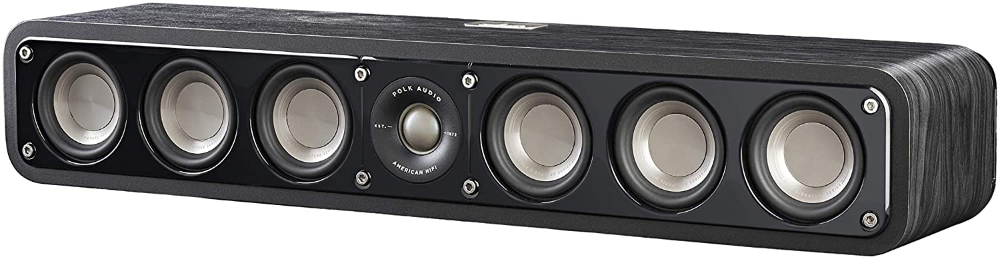 |  | 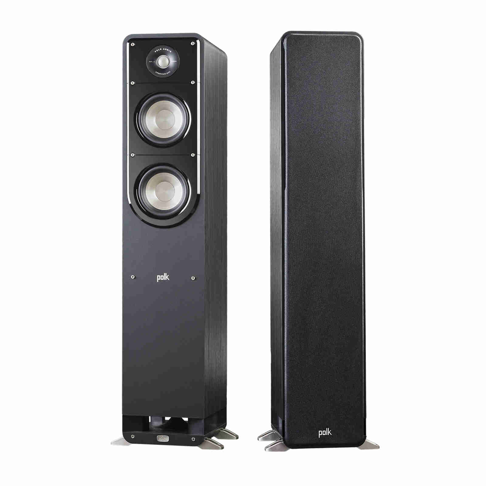 |  |  |

I have a Levovo Smart Tab M8 that is docked in my living room that I use to access my _[Lovelace Dashboards](#lovelace-dashboards)_ including my Home Theater controls in Home Assistant. 
#### Multi Room Audio + Displays
I have a series of Google Home and Nest Mini's scattered throughout the apartment for the purpose of multi-room audio. The audio quality is subpar, but it gets the job done for now. I'm planning on updating to several pairs of Google Nest Audio smart speakers.
| [Google Nest Mini](https://store.google.com/us/product/google_nest_mini?hl=en-US) | [Google Nest Audio](https://store.google.com/us/product/nest_audio?hl=en-US) | Google Nest Hub | [Lenovo Smart Clock](https://www.lenovo.com/gb/en/smart-clock/) | [Lenovo M8 Smart Tablet](https://www.lenovo.com/us/en/p/tablets/android-tablets/lenovo-tab-series/smart-tab-m8-google-assistant/len103l0006) |
| --- | --- | --- | --- | --- |
| 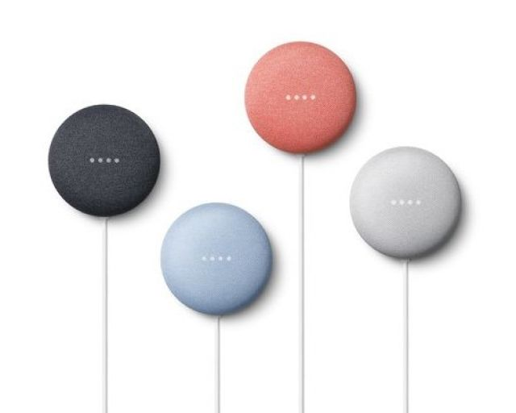 | 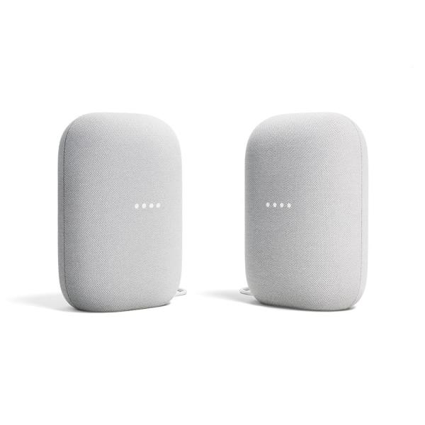 |  |  | 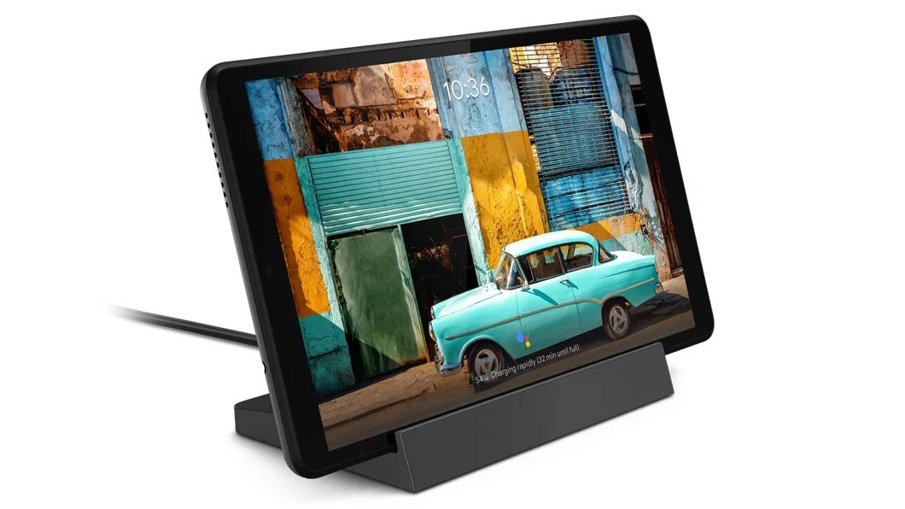 |

The Google Nest Hub lives in the loft and is used as a control panel, picture frame, and alarm clock. The Lenovo Smart Clock lives in the downstairs bedroom (referred to in HA as Office) for use as an alarm clock and simplified control panel.
### Appliances
| [Dyson Pure Cool Purifying Fan TP04](https://www.dyson.com/air-treatment/purifiers/dyson-pure-cool/dyson-pure-cool-tower-white-silver) | [Frigidaire Cool Connect Portable AC FGPC1244T1](https://www.amazon.com/FRIGIDAIRE-Connect-Smart-Portable-Conditioner/dp/B06Y1BLFBN) | [Roborock S4 Robot Vacuum](https://www.amazon.com/Roborock-Navigation-Suction-Multi-Level-Connected/dp/B08CNCB44L) | [LG Smart Washer WM3900HBA](https://www.lg.com/us/washers/lg-WM3900HBA-front-load-washer) | [LG Smart Dryer DLEX3900B](https://www.lg.com/us/dryers/lg-DLEX3900B-electric-dryer) |
| --- | --- | --- | --- | --- |
| 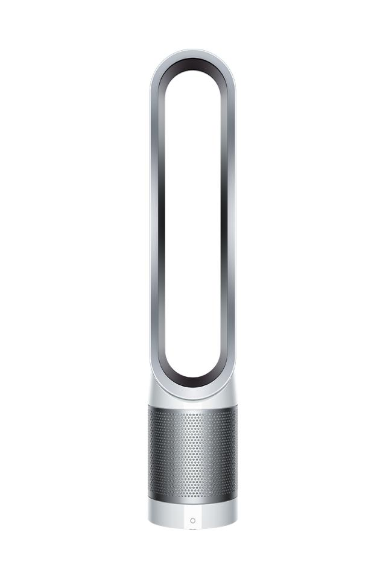 |  |  | 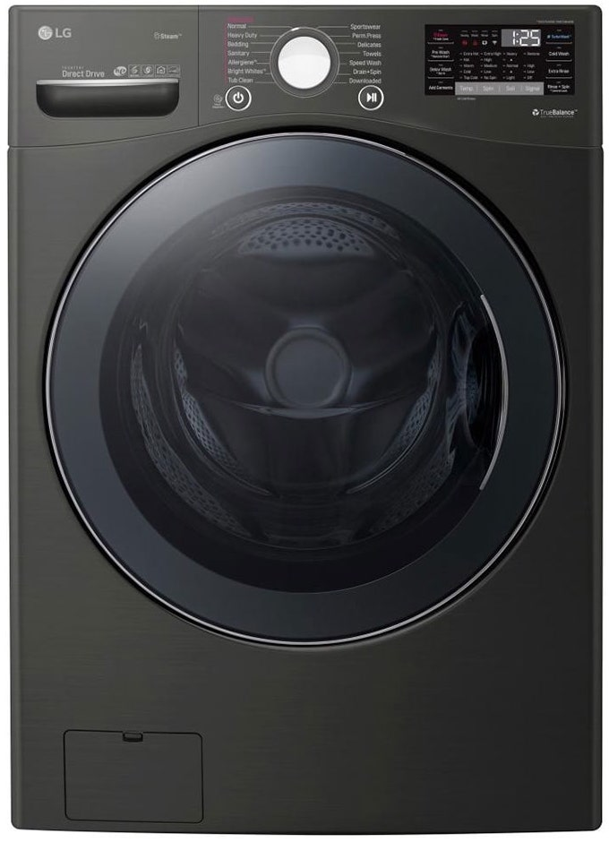 | 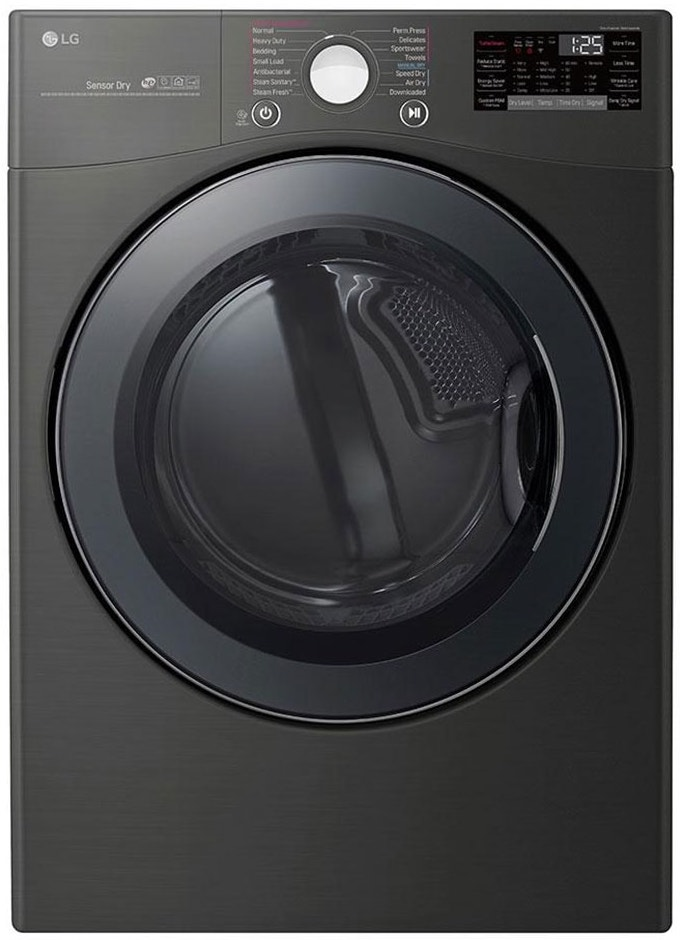 |
#### Climate
My climate situation is pretty simple, just a fan and portable AC. The Dyson air purifying fan (Kirby) lives in the loft and is WiFi enabled. Shortly after purchase I realized it lacked the ability to integrate with Google Assistant, this became a huge driver in me exploring Home Assistant. I was pleasantly surprised to learn it contains a `temperature`, `humidity`, `aqi`, and `dust` sesnor. I successfully integrated Kirby with Home Assistant and am utilizing the `tempurature` and `humidity` sensors in my Lovelace dashboard. The [Climate Kirby](includes/automations/climate_kirby.yaml) automation was created to allow me to stop using the Dyson app for various scheduling functionality.

My apartment has casement windows so my AC options were fairly limited. The Frigidaire Cool Connect Portable AC (Ice Bear) was an easy decision due to it's high BTUs, small footprint, and WiFi conductivity. Unfortunately the smart functionality is incredibly limited and the Frigidaire app very slow to load, making less than ideal for controlling the unit. Thanks to [bm1549](https://github.com/bm1549) I was able to use the [Fridigaire custom component](https://github.com/bm1549/home-assistant-frigidaire) to integrate Ice Bear with Home Assistant. This was a HUGE development as it means I can control the AC via Google Assistant as well.
#### Vacuum
The first floor of my apartment is serviced by a [Roborock S4](https://www.amazon.com/Roborock-Navigation-Suction-Multi-Level-Connected/dp/B08CNCB44L) named Winston. The Roborock S4 intrigued me due to it's lidar, smart mapping, and friendliness with Home Assistant. A lot of people report that you have to do a crazy hack switching the region in Mainland China, but I didn't have to do that, you can read more about my process/HA vacuum implimentation in the wiki under [WINSTON my Roborock S4](https://github.com/theglus/Home-Assistant-Config/wiki/WINSTON-my-Roborock-S4).
#### Lighting
I'm pretty deep into the Hue ecosystem sans my Sengled lightstrip. As a result I have my lights paired directly to the Hue app using the Hue bridge. The main reason I did this instead of utilizing my Raspbee II was so I can ensure my lights remain functional regardless of if Home Assistant is operational. This allows me a lot more flexibility to work with Home Assistant without adversely effecting the other people in my household. 
| [Hue Starter Kit](https://www.amazon.com/Philips-Hue-Ambiance-Starter-Assistant/dp/B07353SKDD/ref=sr_1_20?dchild=1&keywords=philips+hue+starter+kit&qid=1634536245&sr=8-20) | [BR30 White Ambiance](https://www.amazon.com/Philips-Hue-Ambiance-Equivalent-Assistant/dp/B01N536U07) | [Hue Color](https://www.amazon.com/Philips-Hue-Bluetooth-Compatible-Assistant/dp/B08D9N7RJ4) | [Sengled Light Strip](https://www.amazon.com/Sengled-Multicolor-Required-2000-6500K-Assistant/dp/B07QD2SGDB?th=1) |
| --- | --- | --- | --- |
| 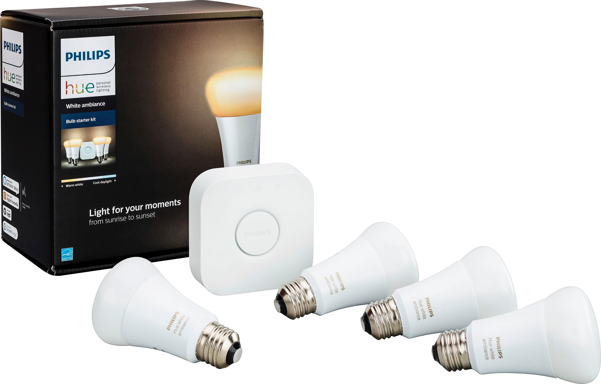 |  |  | 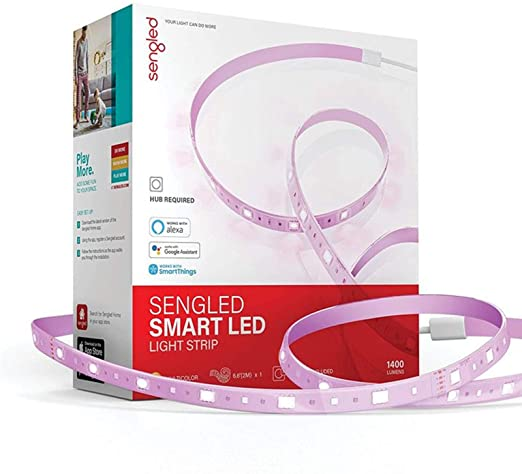 |

The only light outside the Hue ecosystem is my Sengled LED strip. I needed 6 feet of LEDs just for my stairs not to mention the other areas of the apartment, it would have been $79 for 6.5' of Hue lights where Sengled was ~$60 for 16.5'. The LED strip is hooked up directly to the Raspbee II. 
#### Switches + Outlets
I have a series of smart plugs which I use to control various appliances. Currently I have my printer (Major Laser Printer) and my kitchen kettle hooked up to two Kasa HS103 outlets which I control mainly through automations and Google Assistant. I recently purchased a Kasa 3-outlet surge protector which I have yet to determine how I will utilize.
| [Hue Smart Plug](https://www.amazon.com/Philips-Hue-Lights-Bluetooth-compatible/dp/B07XD578LD) | [Kasa HS103 Smart Plug](https://amazon.com/gp/product/B07B8W2KHZ/ref=ppx_yo_dt_b_search_asin_title?ie=UTF8&psc=1) | [Kasa 3-plug Surge](https://www.amazon.com/Kasa-Smart-Protector-Required-KP303/dp/B083JKSSR5) | [Lutron Aurora](https://www.amazon.com/Lutron-Aurora-Dimmer-Philips-Z3-1BRL-WH-L0/dp/B07RJ14FBS) | 
| --- | --- | --- | --- |
| 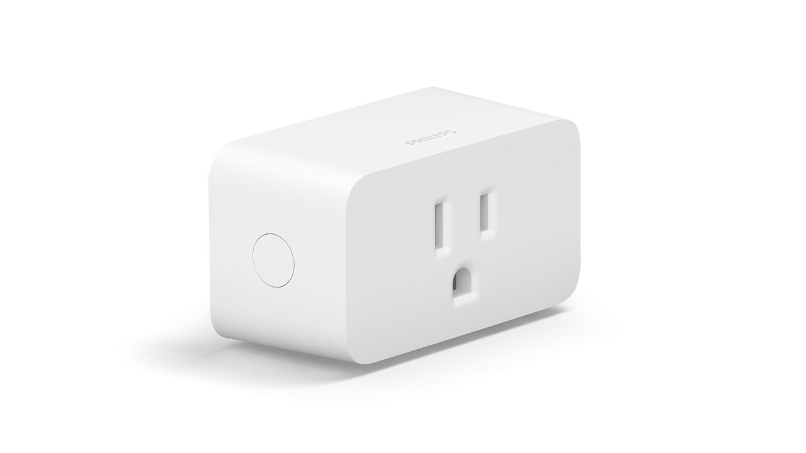 | 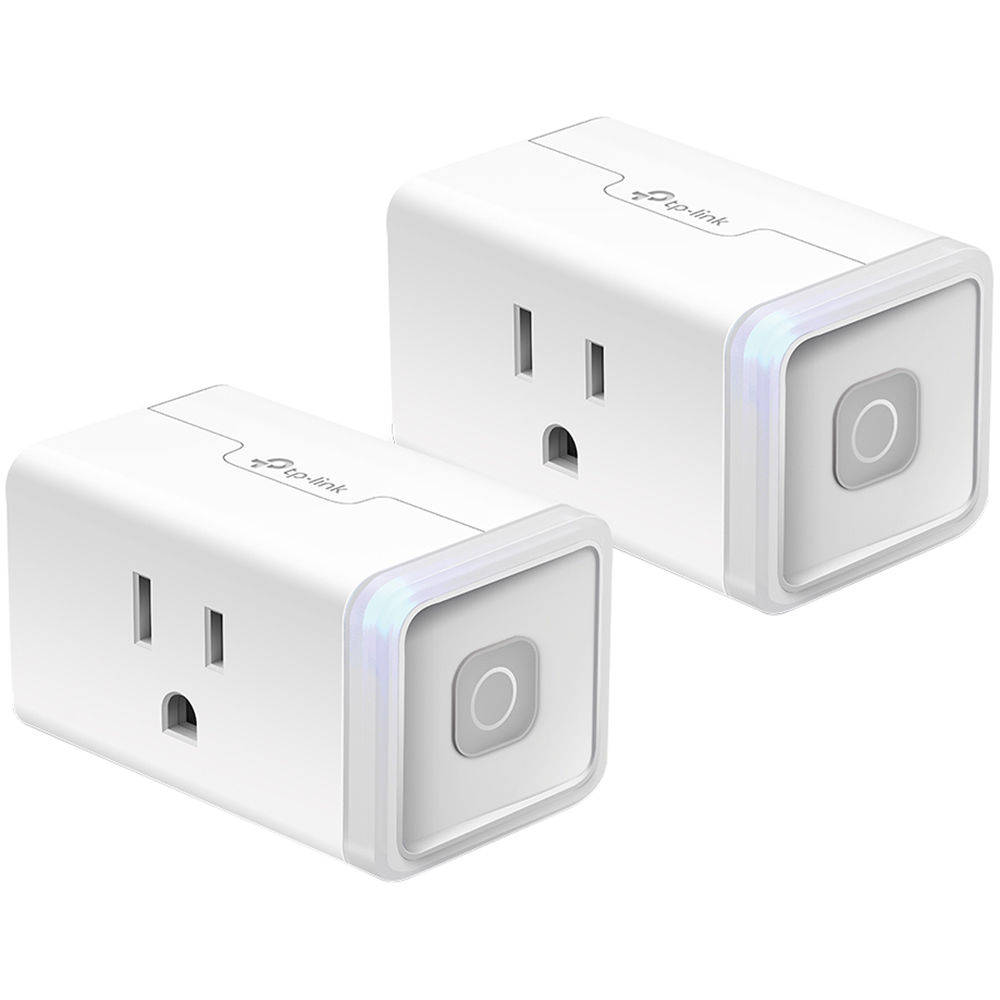 |  |  |

My old school analog marquee is controlled by the Hue plug which I opted for due to it's ability to be integrated with my other lights via the Hue ecosystem. Lastly, sometimes it's just quicker and quieter to turn on the lights with a switch, being a renter replacing my wall switches isn't appealing. Luckily I discovered Lutron Aurora dimmers which not only gives me a physical button but also a dimmer which I can map to one or many lights. I'm hoping to figure out a way to map secondary actions (double click, triple click, etc.), but the feasiblity is TBD.

Thanks for reading, please star if your are interested in the project.
## Lovelace Dashboards
* [Quick Access Controls](#quick-access-controls)
  * [Room Controls](#room-controls)
  * [Hallway Controls](#hallway-controls)
  * [Light Popup](#light-popup)
  * [Animated Icons](#animated-icons)
* [Vacuum Dasboard](#vacuum-dashboard)
* [System Dashboard](#system-dashboard)
### Quick Access Controls
The Quick Access Controls are a logical grouping of Lovelace buttons + cards using many of the [above listed custom components](#custom-components). The inspiration for Quick Access came from stumbling upon [Crixle's Light Control Card](https://github.com/crixle/homeassistant-config#light-control-card) via r/homeassistant. I was fascinated by the idea of reducing the number of clicks required to control my smart home. This led me to overhaul my Lovelace setup with the goal of making all essential controls availible in 3-clicks or less.

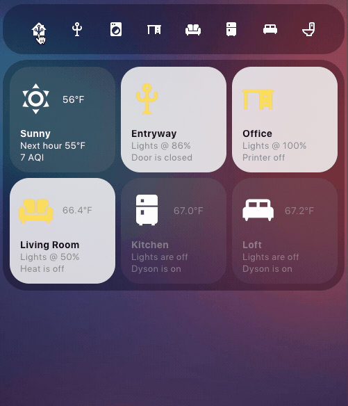 
<details>
  <summary>Code</summary>
  
```
#################################################################
#----------------------------------------------------------------
## Toggle Nav
#----------------------------------------------------------------
#################################################################
entities:
  - type: "custom:paper-buttons-row"
    buttons:
      #################################################################
      ## General Button
      #################################################################
      - entity: input_select.lighttoggle
        name: false
        icon: "mdi:home-assistant"
        state_styles:
          General:
          template: nav_button
        template: nav_styles
        tap_action:
          action: call-service
          service: input_select.select_option
          service_data:
            entity_id: input_select.lighttoggle
            option: General
      #################################################################
      ## Entryway Button
      #################################################################
      - entity: input_select.lighttoggle
        name: false
        icon: "mdi:coat-rack"
        state_styles:
          Entrway:
          template: nav_button
        template: nav_styles
        tap_action:
          action: call-service
          service: input_select.select_option
          service_data:
            entity_id: input_select.lighttoggle
            option: Entryway
#################################################################
#----------------------------------------------------------------
## Expanded
#----------------------------------------------------------------
#################################################################
- type: "custom:state-switch"
  entity: input_select.lighttoggle
  default: Entryway
  transition: none
  states:
  #################################################################
  ## General Controls
  #################################################################
  General:
    type: "custom:mod-card"
    style: |
      ha-card { 
        background: rgba(0,0,0,.3); 
        padding: 10px; 
        border-radius: 35px; 
        margin-top: none; 
        }
    card:
      type: grid
      columns: 3
      cards:

    ## <--- Buttons --->
  
  #################################################################
  ## Entryway Controls
  #################################################################
  General:
    type: "custom:mod-card"
    style: |
      ha-card { 
        background: rgba(0,0,0,.3); 
        padding: 10px; 
        border-radius: 35px; 
        margin-top: none; 
        }
    card:
      type: grid
      columns: 3
      cards:

    ## <--- Buttons --->
```
</details>

### Room Controls

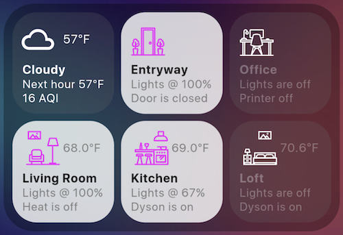

### Hallway Controls


<details>
  <summary>Code</summary>
  
```
#################################################################
## Entrway Controls
#################################################################
Entryway:
  type: "custom:mod-card"
  style: |
    ha-card { 
      background: rgba(0,0,0,.3); 
      padding: 10px; 
      border-radius: 35px; 
      margin-top: none; 
      }
  card:
    type: grid
    columns: 3
    cards:
      #----------------------------------------------------------------
      ## Hallway Marquee
      #----------------------------------------------------------------
      - type: "custom:button-card"
        entity: light.hallway_marquee
        template:
          - icon_marquee
      #----------------------------------------------------------------
      ## Hallway Runner
      #----------------------------------------------------------------
      - type: "custom:button-card"
        entity: light.hallway_runner
        name: Runner
        template: 
          - light_color
          - icon_led
      #----------------------------------------------------------------
      ## Potter Lamp
      #----------------------------------------------------------------
      - type: "custom:button-card"
        entity: light.potter_lamp
        name: Lamp
        template:
          - light_color
          - icon_lamp
      #----------------------------------------------------------------
      ## Stair Light
      #----------------------------------------------------------------
      - type: "custom:button-card"
        entity: light.stair
        name: Lamp
        template:
          - light
          - icon_spot
      #----------------------------------------------------------------
      ## Front Door Sensor
      #----------------------------------------------------------------
      - type: "custom:button-card"
        entity: binary_sensor.front_door
        # TODO: #38 Create icon_door button template
        template: 
          - base
          - icon_door
      #----------------------------------------------------------------
      ## Hallway Smart Clock
      #----------------------------------------------------------------
      # TODO: #315 Alarm + timer countdown for Google Home devices.
      - type: custom:button-card
        entity: media_player.smart_clock
        name: Smart Clock
        template:
          - base
          - icon_smart_clock
```
</details>

## Planned Improvements
- [x] [Notification Automations + Water Alerts](https://github.com/theglus/Home-Assistant-Config/milestone/26)
- [x] [Tackle Nanoleaf pop-up + light button bugs](https://github.com/theglus/Home-Assistant-Config/milestone/29)
- [x] [Create buttons for remaining Google Home devices](https://github.com/theglus/Home-Assistant-Config/milestone/18)
- [ ] [Granular Google Home Controls](https://github.com/theglus/Home-Assistant-Config/milestone/19)
- [ ] [Dyson Controls](https://github.com/theglus/Home-Assistant-Config/milestone/27)
- [ ] [AC climate pop-up](https://github.com/theglus/Home-Assistant-Config/milestone/24)
- [ ] [Laundry Machine Controls](https://github.com/theglus/Home-Assistant-Config/milestone/5)
- [ ] [Winston Interface + Automations](https://github.com/theglus/Home-Assistant-Config/milestone/20)
- [ ] [Home Theater Controls](https://github.com/theglus/Home-Assistant-Config/milestone/30)
- [ ] [Improved Printer + Paper Shredder buttons](https://github.com/theglus/Home-Assistant-Config/milestone/23)
- [ ] [Animate various light buttons](https://github.com/theglus/Home-Assistant-Config/milestone/7)
- [ ] [GH Cleanup + Documentation](https://github.com/theglus/Home-Assistant-Config/milestone/15)
## Automations
- [Alert Leak](includes/automations/alert_leak.yaml): Alert when water is detected under the sink or dishwasher.
- [Charge Toothbrushes](includes/automations/charge_toothbrushes.yaml): Start charging toothbrushes at 12 am and stop at 4 am.
- [Climate Kirby](includes/automations/climate_kirby.yaml): Trigger [Kirby: Daytime](includes/scenes/kirby_daymode.yaml) @ 8 am + [Kirby: Nighttime](includes/scenes/kirby_nightmode.yaml) @ 9 pm.
- [Climate Loft](includes/automations/climate_loft.yaml): Turn on fan when Loft is ≥72° and off when ≤71°.
- [Climate Office Off](includes/automations/climate_office_off.yaml): Turn fan OFF based off of Overhead light group.
- [Climate Office On](includes/automations/climate_office_on.yaml): Turn fan ON based off of Overhead light group.
- [Leave Home](includes/automations/leave_home.yaml): Notify smartphones of door status + turn off lights accordingly.
- [Notify AQU](includes/automations/notify_aqi.yaml): Notify Smartphones when AQI is >75.
- [Notify Dryer](includes/automations/notify_dryer.yaml): Notify smartphones when dryer is complete.
- [Notify Heat Wave](includes/automations/notify_heatwave.yaml): Notify smartphones when tomorrows high is  >75 °F.
- [Notify Printer](includes/automations/notification_printer.yaml): Notify Smartphones when Major Laser Printer is ready.
- [Notify Washer](includes/automations/notify_washer.yaml): Notify smartphones when washer is complete.
- [On Air](includes/automations/on_air.yaml): Turn Potter light red when webcam turns on.
- [Peak Usage Alerts](includes/automations/peak_usage_alerts.yaml): Notify Smartphones when AC, Washer, or Dryer is on during peak usage. 
- [Server Boot Up](includes/automations/server_boot_up.yaml): Notify via Telegram when server has booted up.
- [Server Reboot](includes/automations/server_reboot.yaml): Telegram notification that alerts of server reboot, restart, or shutdown.
- [Set Theme](includes/automations/set_theme.yaml): Set theme at Home Assistant start.
- [Printer Shutoff](includes/automations/shutoff_printer.yaml): Shutoff plug to printer 15-minutes after device has been switched on.
- [Shutdown Shredder](includes/automations/shutoff_shredder.yaml): Shutoff plug to paper shredder 2-minutes after device has been switched on.
- [Vacuum Clean](includes/automations/vacuum_clean.yaml): Notify Smartphones when Winston starts cleaning.
- [Vacuum Docked](includes/automations/vacuum_done.yaml): Notify Smartphones when Winston has returned to dock.
- [Vacuum Done](includes/automations/vacuum_done.yaml): Notify Smartphones when Winston has completed cleaning.
- [Volume Home](includes/automations/volume_home.yaml): Turn down volume of Google Home device at 10 pm.
