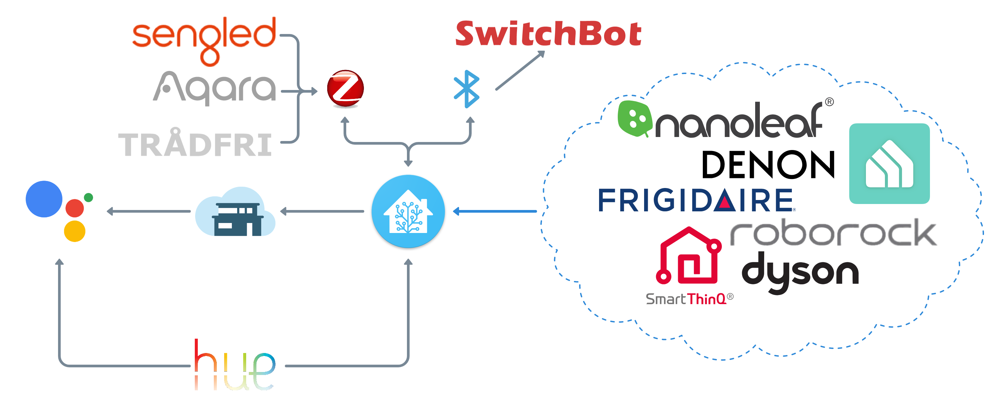

# Home-Assistant-Config
Welcome to theglus's Home Assistant setup. I hope you find value in the projects and documentation I've been working on. I'll be continuting to update my documentaion in the coming weeks so stay tuned. 
## Table of Contents 
* [Hardware](#hardware)
* [Software](#software)
* [Devices](#devices)
# Hardware
## Home Assistant Hardware
My Home Assistant setup is pretty basic but it gets the job done without any hiccups. I originally planned on booting off of a USB drive, but gave up after the first couple failed attempts in favor in spending the time to actually setup my smart home. I'm exploring the idea of moving the DB and logs a Sandisk USB, but I'm unsure if that will resolve the sluggish page loading. What would make the most sense would be to go the SSD boot route, but it's pretty low on my priority list. 
| Raspberry Pi 4 Model B 4GB | Raspbee II | SanDisk Extreme 64GB MicroSD | Argon Neo Case |
| --- | --- | --- | --- |
|  |  |  |  |

I opted to go the Zigbee route primarily because I really like the Aqara platform. I landed on the Raspbee II over the Conbee as it just seemed like a more elegant solution. It's a little bit of a pain to initially setup, but after that it's smooth sailing. 
# Software
## Software + Architecture
 
## Voice Assistant
I'm currently utilizing Nabu Casa to leverage Google Assistant via the aforementioned Google Home devices to enable voice controls. I mainly use voice commands to trigger the lights, music, and theater system. I would like to setup voice commands for Winston and Kirby in the near future. 
# Devices
## Audio & Video
### Home Theater
I recently built out my home theater system centered around my Denon S960H + NVIDIA SHIELD TV Pro and managed by Home Assistant using `denonavr`, `androidtv`, and `media_player`. The system is primarly controlled using the NVIDIA SHIELD Toblerone as it can accomplish almost everything I need via CEC. The main gaps currently in the system are the following Denon buttons `Setup`, `Options`, `Info`, `Back`, `ECO`, `Input` and the following Sony Bravia buttons `Settings`, `Home`. I currently have a _Home Theater_ Lovelace view which I use to control powering one or many entities (TV, AV, Shield) as well as switching between `AUTO` and `SETTING` Denon sound modes. 
| Denon 960H | Polk S35 | Polk S10 | Polk S15 | NVIDIA SHIELD TV Pro | Sony TV |
| --- | --- | --- | --- | --- | --- |
|  |  |  |  |  |  |

I have a Levovo Smart Tab M8 that is docked in my living room that I use to access the _Home Theater_ view in Home Assistant. This view is very much a WIP progress and is my focus over the coming weeks.
### Multi Room Audio
I have a series of Google Home and Nest Mini's scattered throughout the apartment for the purpose of multi-room audio. The audio quality is subpar, but it gets the job done for now. I eventually plan on augmenting the audio with several Denon Home speakers.
| Google Home/Nest Mini | Google Nest Hub | Lenovo Smart Clock |
| --- | --- | --- | 
|  |  |  |

The Google Nest Hub lives in the loft and is used as a control panel, picture frame, and alarm clock. The Lenovo Smart Clock lives in the downstairs bedroom (referred to in HA as Office) for use as an alarm clock and simplified control panel.
## Appliances
| Dyson Pure Cool Purifying Fan TP04 | Frigidaire Cool Connect Portable AC FGPC1244T1 | Roborock S4 Robot Vacuum |
| --- | --- | --- |
|  |  |  |
### Climate
My climate situation is pretty simple, just a fan and portable AC. The Dyson air purifying fan (Kirby) lives in the loft and is WiFi enabled. Shortly after purchase I realized it lacked the ability to integrate with Google Assistant, this became a huge driver in me exploring Home Assistant. I was pleasantly surprised to learn it contains a `temperature`, `humidity`, `aqi`, and `dust` sesnor. I successfully integrated Kirby with Home Assistant and am utilizing the `tempurature` and `humidity` sensors in my Lovelace dashboard. 
I have plans to create a comprehensive fan/purifier control card as a keystone for my climate view in HA.
My apartment has casement windows so my AC options were fairly limited. The Frigidaire Cool Connect Portable AC (Ice Bear) was an easy decision due to it's high BTUs, small footprint, and WiFi conductivity. Unfortunately the smart functionality is incredibly limited and the Frigidaire app is complete garabage. I have yet to figure out a strategy to get Ice Bear into Home Assistant, but haven't given up hope!
### Vacuum
I recently replaced my Eufy robovac due to it's tendency to try to kill itself by ramming into various objects. The Roborock S4 (Winston) intrigued me due to it's lidar, smart mapping, and friendliness with Home Assistant. A lot of people report that you have to do a crazy hack switching the region in Mainland China, but I didn't have to do that, you can read more about my process/HA vacuum implimentation in the wiki under [Project WINSTON](https://github.com/theglus/Home-Assistant-Config/wiki/Project-WINSTON:-Roborock-S4).
## Lighting
I'm pretty deep into the Hue ecosystem sans my Sengled lightstrip. As a result I have my lights paired directly to the Hue app using the Hue bridge. The main reason I did this instead of utilizing my Raspbee II was so I can ensure my lights remain functional regardless of if Home Assistant is operational. This allows me a lot more flexibility to work with Home Assistant without adversely effecting the other people in my household. 
| Hue Starter Kit | BR30 White Ambiance | Hue Color | Sengled Light Strip |
| --- | --- | --- | --- |
|  |  |  |  |

The only light outside the Hue ecosystem is my Sengled LED strip. I needed 6 feet of LEDs just for my stairs not to mention the other areas of the apartment, it would have been $79 for 6.5' of Hue lights where Sengled was ~$60 for 16.5'. The LED strip is hooked up directly to the Raspbee II. 
## Switches + Outlets
I have a series of smart plugs which I use to control various appliances. Currently I have my printer (Major Laser Printer) and my kitchen kettle hooked up to two Kasa HS103 outlets which I control mainly through automations and Google Assistant. I recently purchased a Kasa 3-outlet surge protector which I have yet to determine how I will utilize.
| Hue Smart Plug | [Kasa HS103 Smart Plug](https://smile.amazon.com/gp/product/B07B8W2KHZ/ref=ppx_yo_dt_b_search_asin_title?ie=UTF8&psc=1) | Kasa 3-plug Surge | Lutron Aurora | 
| --- | --- | --- | --- |
|  |  |  |  |

My old school analog marquee is controlled by the Hue plug which I opted for due to it's ability to be integrated with my other lights via the Hue ecosystem. Lastly, sometimes it's just quicker and quieter to turn on the lights with a switch, being a renter replacing my wall switches isn't appealing. Luckily I discovered Lutron Aurora dimmers which not only gives me a physical button but also a dimmer which I can map to one or many lights. I'm hoping to figure out a way to map secondary actions (double click, triple click, etc.), but the feasiblity is TBD.

Thanks for reading, please star if your are interested in the project.
